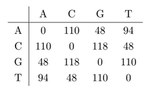
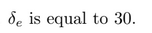
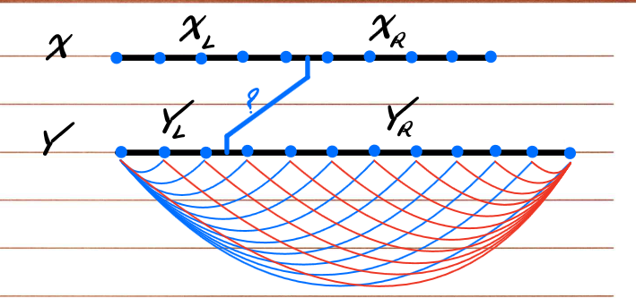

# DNA Sequence Alignment

DNA sequence alignment involves finding similarity between two DNA strings. Similarity can be measured by finding the cost of alignment between two strings, ie. lower the cost, greater the similarity.

The alignment costs used are mentioned below:



Delta cost is as follows:



## Dynamic Programming solution:

The straightforward dynamic programming solution to find the lease cost can be characterised with this recurrence relation:

```
dp[i, j] = min( dp[i - 1, j] + delta, 
                dp[i, j - 1] + delta, 
                dp[i - 1, j - 1] + mismatch(string1[i], string[j]))
```

To find the actual strings, we need to do a top-down pass on our tabulation. This requires us to store the entire table as we cannot afford to lose any information.
Since DNA strings can be very large, the dynamic programming approach is not memory efficient.

## Memory Efficient Solution (Divide and Conquer + Dynamic programming)

The naive dynamic programming approach for DNA sequence alignment uses a two-dimensional table of size *m × n*, where *m* and *n* are the lengths of the two DNA sequences. While this approach is effective in terms of time complexity (**O(m × n)**), it suffers from high space complexity, which becomes a serious bottleneck when aligning large DNA sequences.

To address this, a memory-efficient solution based on **Hirschberg's Algorithm** is implemented. Hirschberg’s algorithm leverages the idea that, while the full alignment table is required to reconstruct the final aligned strings using the traditional DP approach, we can in fact reconstruct the alignment using only a subset of information — specifically, the alignment costs of certain prefixes and suffixes.

This approach combines **divide and conquer** with **dynamic programming** and works as follows:

---

### 📌 Overview Diagram

The diagram below illustrates how the problem is split and solved recursively using cost vectors to identify optimal partitioning:



---

### 1. Divide the Problem

Instead of solving the entire alignment problem in one go, we divide the problem into smaller subproblems. One of the strings (say, string `X`) is split at the midpoint. The goal is to determine the best place to split the other string (`Y`) so that we can recursively align the left halves and right halves separately.

To do this, we compute two **cost vectors**:
- A forward cost vector from the start of `X` to its midpoint.
- A backward cost vector from the end of `X` to its midpoint (done in reverse).

Each of these vectors is of length `n + 1`, where `n` is the length of string `Y`. Each vector stores the alignment cost of aligning the current segment of string `X` with various prefixes/suffixes of string `Y`.

---

### 2. Find Optimal Split Point

The optimal split point in string `Y` is the index `j` where the **sum of the forward cost and backward cost is minimized**. This gives us the point in `Y` that best aligns with the midpoint of `X`.

Once we have the split point, we recursively apply the same procedure to the left and right halves of both strings.

---

### 3. Base Case

When the strings are small enough (e.g., one of them has length 0 or 1), we fall back to the standard dynamic programming solution, which is fast and does not require much memory in this small scale.

---

### 4. Reconstruct the Alignment

As the recursion unwinds, the aligned segments from the subproblems are concatenated to reconstruct the full alignment of the original strings. Despite never storing the full DP matrix, we are still able to determine the alignment sequence correctly.

---

### 5. Memory Efficiency

This method reduces the space complexity of the alignment from **O(m × n)** to **O(n)**, since at any given point we only store one or two rows of the DP table for the cost vectors. This makes it especially suitable for aligning large DNA sequences where memory is a limiting factor.


